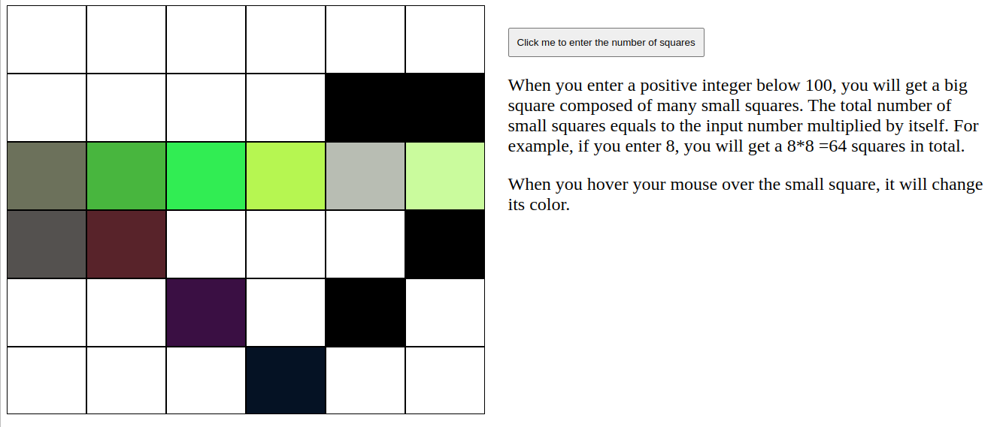

# odin_Etch-A-Sketch

[Task Description](https://www.theodinproject.com/lessons/foundations-etch-a-sketch)

[Live Preview](https://maxim55069633.github.io/4.odin_Etch_A_Sketch/)

This project helps me to hone my DOM manipulation skills. 

update:
I misunderstand the task first, but I find a better solution that can accomplish the darken the path everytime the mouse passes. Impressive!
[code](https://github.com/andrewjh271/etch-a-sketch) |  [live](https://andrewjh271.github.io/etch-a-sketch/)

---

In this project, I learn:

1. Make the divs appear as a grid in an equal amount of size dynamically.

Flex saves me. It can grow or shrink dynamically no matter what number I enter.

2. QuerySelector doesn't work. The console.log reminds me that:
`Uncaught TypeError: Cannot setproperties of null.`

I check my codes and fail to find obvious mistakes first. Later on, I find queryselector doesn't catch an element. I realize I forget to add a defer property to the javascript on the html. When the html tags are not generated, the javascript naturally doesn't catch. The order of codes matters.

3. (Unsolved) I can't find a way to generate the mix of random color and black.

After some google search, I find a color-mix function. However, it is only supported by a few browser versions.
Then I come up with a the subsitute plan using hsl color. When the colorlightness is set to 0, the color is black. However, the higher colorlightness is, it is closer to white, not the expected mix of random color and black. 
 
Screenshot:

